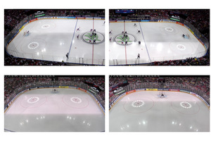
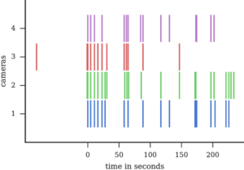

Date: 2016-12-20
Tags: publication
Title: Rolling Shutter Camera Synchronization with Sub-millisecond Accuracy

 

## Abstract

A simple method for synchronization of video streams with a precision better than one millisecond is proposed. The method is applicable to any number of rolling shutter cameras and when a few photographic flashes or other abrupt lighting changes are present in the video. The approach exploits the rolling shutter sensor property that every sensor row starts its exposure with a small delay after the onset of the previous row. The cameras may have different frame rates and resolutions, and need not have overlapping fields of view. The method was validated on five minutes of four streams from an ice hockey match. The found transformation maps events visible in all cameras to a reference time with a standard deviation of the temporal error in the range of 0.3 to 0.5 milliseconds. The quality of the synchronization is demonstrated on temporally and spatially overlapping images of a fast moving puck observed in two cameras.


## Paper

[![paper thumbnails][2]][1]

  [1]: download/visapp2017_camera_ready_web.pdf
  [2]: images/visapp2017/paper_teaser.png

## Cite

M. Šmíd and J. Matas, “Rolling Shutter Camera Synchronization with Sub-millisecond Accuracy,” in VISAPP - 12th International Conference on Computer Vision Theory and Applications, 2017.

## Your Video Sequences

I would like to evaluate the software on more multi-view video sequences with abrupt lighting changes. If you can provide your data, please contact me.

## Code

We published the synchronization method as an easy to use python module: <https://github.com/smidm/flashvideosynchronization>.

```python
sync = flashvideosynchronization.FlashVideoSynchronization()
sync.detect_flash_events(filenames)

matching_events = {1: 3, 3: 2, 2: 8, 4: 2}
offsets = {cam: sync.events[cam][matching_events[cam]]['time'] for cam in cameras}

# synchronize cameras: find parameters of transformations that map camera time to reference camera time
sync.synchronize(cameras, offsets, base_cam=1)

# get sub-frame sychronized time for camera 1, frame 10 and row 100
print sync.get_time(cam=1, frame_time=timestamps[1][10], row=100) 

# get frame synchronized image sources
sources_sync = sync.get_synchronized_image_sources(sources, master=1, dropped=False)

# show synchronized frames
frame = 10
for cam in cameras:
    plt.figure()
    plt.imshow(sources_sync[cam].get_image(frame))
```

## Executable paper

The figures and experimental results can be examined and reproduced with a single Jupyter notebook published at <https://github.com/smidm/flashvideosynchronization-notebook>.


