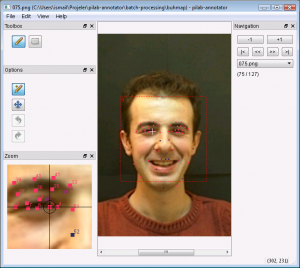

Date: 2013-09-11
Title: Image Ground Truth GUI Tools
Tags: python

Evaluation of computer vision algorithms usually requires comparison against manually created [ground truth](http://en.wikipedia.org/wiki/Ground_truth). Following two GUI tools are easy to use for a basic annotation in images. Both are written in Python and should be easy to modify.

<!-- PELICAN_END_SUMMARY -->

## pilab-annotator

<http://code.google.com/p/pilab-annotator/>

features:

- works with image series
- saves annotated objects to xml files
- supports annotating of point and rectangle objects

## pylabelme

<https://github.com/mpitid/pylabelme>

features:

- works with a single image
- supports polygon annotations
- saves annotated objects to json files

Pylableme workflow is demonstrated in the following [screencast](https://github.com/mpitid/pylabelme/raw/master/screencast.ogv).

